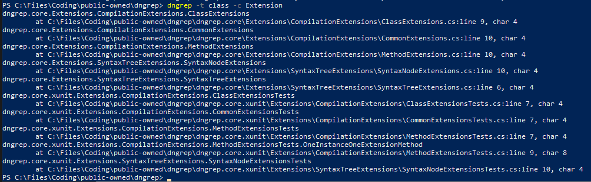

# dngrep Global Tool

## What is it

`dngrep.tool` is a global tool for syntax-aware search inside C# projects directly from a command line.

Simply install, open any repository or folder containing `.sln` and/or `.csproj`, run command `dngrep` (or `dngrep -h` to see the available options).

## Installation

After you have installed DotNet Core, you can install this tool using the following command:

```sh
dotnet tool install -g dngrep
```

For the older versions or preview packages, use:

```sh
dotnet tool install -g dngrep --version 0.0.1
```

For installing the package from a local repository:

```sh
dotnet pack
dotnet tool install --global --add-source ./dngrep.tool/nupkg dngrep
```

For uninstalling, use:

```sh
dotnet tool uninstall -g dngrep
```

## Example Usage

You can clone this repository and run `dngrep` inside it.

Let's say you'd like to find all classes that have `Extension` in their name:

```sh
dngrep -t class -c Extension
```

Output:



But what if you don't want to see any tests? Just add the exclude option:

```sh
dngrep -t class -r true -c Syntax.*Extension -e Test
```

Output:


Then assume you'd like to see only classes that also starts with `Syntax`. Just enable regex and run the following command:

```sh
dngrep -t class -r true -c Syntax.*Extension -e Test
```

Output:


And what if you don't want to see any namespaces and file paths and want a bit cleaner output? Simply add other options:

```sh
dngrep -t class --hide-namespaces true -r true -p false -l false -c Syntax.*Extension -e Test
```

Output:


